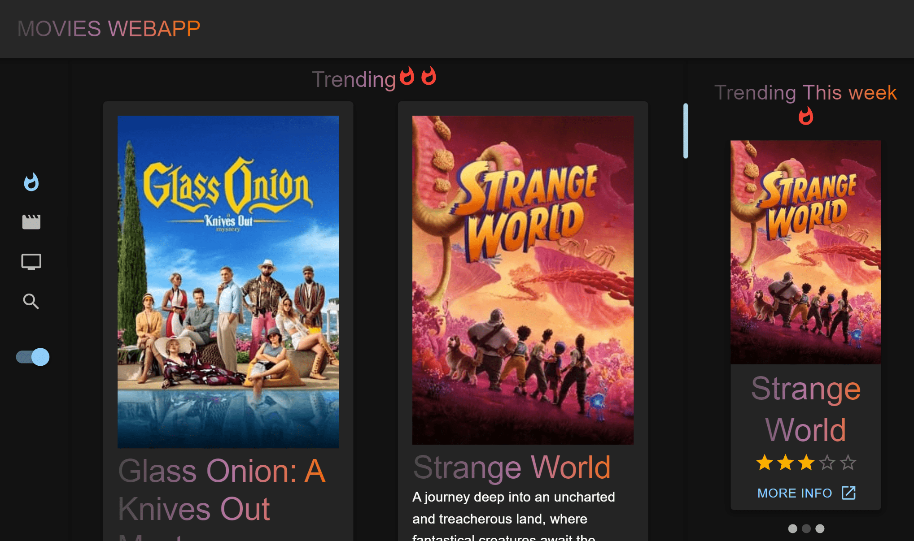

<!-- Please update value in the {}  -->

<h1 align="center">Entertainment Web-app</h1>

   Live url here <a href="https://poetic-profiterole-9f8a10.netlify.app/" target="_blank">Entertainment-hub</a>.

### Built With

<!-- This section should list any major frameworks that you built your project using. Here are a few examples.-->

- [React](https://reactjs.org/)
- [MUI](https://mui.com)
